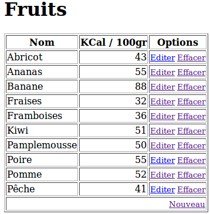
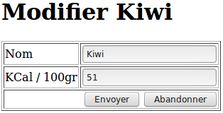

# Mini-Projet Fruits
Fruits est un Mini-projet visant à démontrer la mise en œuvre d'une base de données SQLite 3 dans un projet Flask.

Pour que la démonstration soit satisfaisante, l'exemple va au-delà de la simple connexion SQLite en proposant quelques fonctionnalités de bases comme lister le contenu d'une table de fruits et proposer la modification d'enregistrements. 

Il mettra donc en œuvre la connexion SQLite, les routes, édition de form HTML (GET et POST), des templates Jinja.

_Le but du mini-projet est d'offrir un maximum de fonctionnalités avec un minimum de complexité.  

A l'exception de CSS (esthétisme) et de WTF (saisie et validation de Form HTML), cet exemple est ce qui se rapproche le plus d'une vraie application Flask.

mkdir pythonFlask
cd pythonFlask
%PYTHON_HOME%\Scripts\virtualenv.exe env

%PYTHON_HOME%\python -m pip list
Package                           Version
--------------------------------- -------
backports.entry-points-selectable 1.1.0
distlib                           0.3.2
filelock                          3.0.12
pip                               21.2.4
platformdirs                      2.2.0
setuptools                        56.0.0
six                               1.16.0
virtualenv                        20.7.2

.\env\Scripts\python -m pip install --upgrade pip
Requirement already satisfied: pip in d:\yobo\workspace\pycharmprojects\pythonflask\env\lib\site-packages (21.2.3)
Collecting pip
  Using cached pip-21.2.4-py3-none-any.whl (1.6 MB)
Installing collected packages: pip
  Attempting uninstall: pip
    Found existing installation: pip 21.2.3
    Uninstalling pip-21.2.3:
      Successfully uninstalled pip-21.2.3
Successfully installed pip-21.2.4

.\env\Scripts\python -m pip install flask
Collecting flask
  Downloading Flask-2.0.1-py3-none-any.whl (94 kB)
     |████████████████████████████████| 94 kB 652 kB/s
Collecting click>=7.1.2
  Downloading click-8.0.1-py3-none-any.whl (97 kB)
     |████████████████████████████████| 97 kB 735 kB/s
Collecting Jinja2>=3.0
  Downloading Jinja2-3.0.1-py3-none-any.whl (133 kB)
     |████████████████████████████████| 133 kB 1.1 MB/s
Collecting Werkzeug>=2.0
  Downloading Werkzeug-2.0.1-py3-none-any.whl (288 kB)
     |████████████████████████████████| 288 kB 1.3 MB/s
Collecting itsdangerous>=2.0
  Downloading itsdangerous-2.0.1-py3-none-any.whl (18 kB)
Collecting colorama
  Using cached colorama-0.4.4-py2.py3-none-any.whl (16 kB)
Collecting MarkupSafe>=2.0
  Downloading MarkupSafe-2.0.1-cp39-cp39-win_amd64.whl (14 kB)
Installing collected packages: MarkupSafe, colorama, Werkzeug, Jinja2, itsdangerous, click, flask
Successfully installed Jinja2-3.0.1 MarkupSafe-2.0.1 Werkzeug-2.0.1 click-8.0.1 colorama-0.4.4 flask-2.0.1 itsdangerous-2.0.1

# save this as app.py
from flask import Flask, escape, request

app = Flask(__name__)

@app.route('/')
def hello():
    name = request.args.get("name", "World")
    return f'Hello, {escape(name)}!'

# Run
.\env\Scripts\flask run
 * Running on http://127.0.0.1:5000/ (Press CTRL+C to quit)

